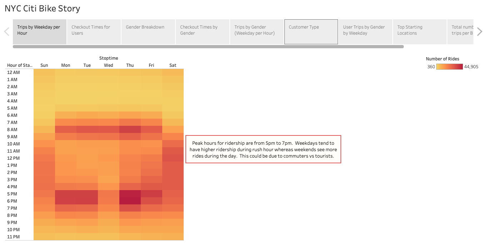
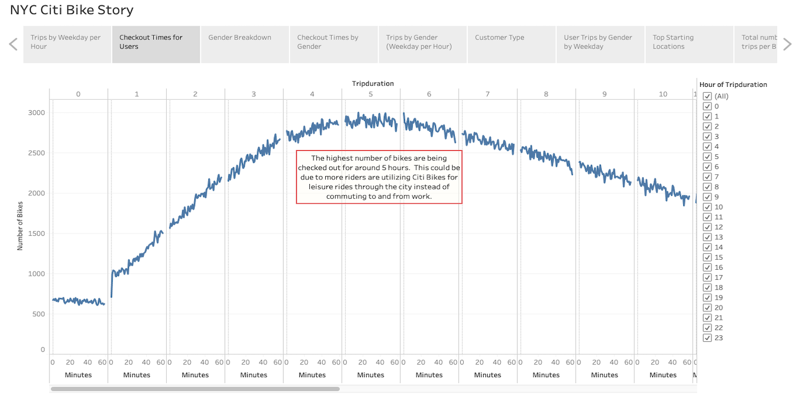
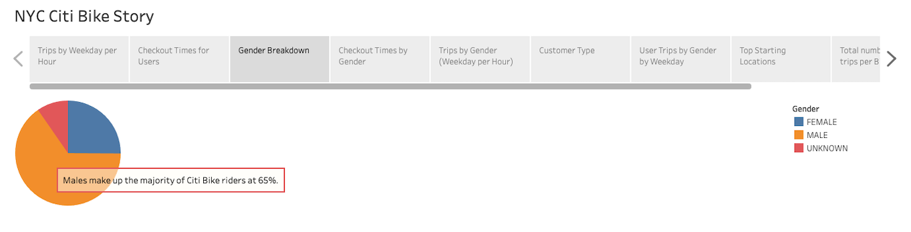
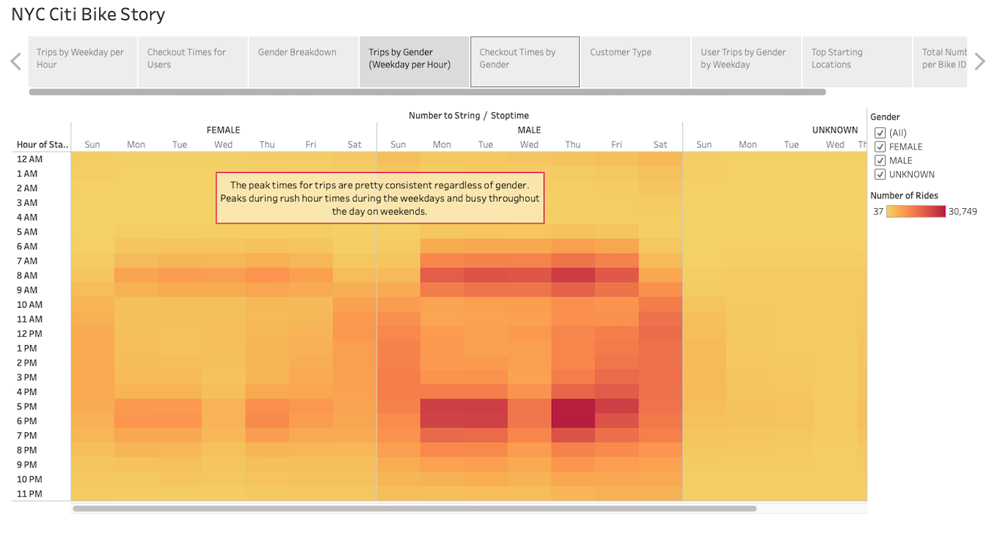
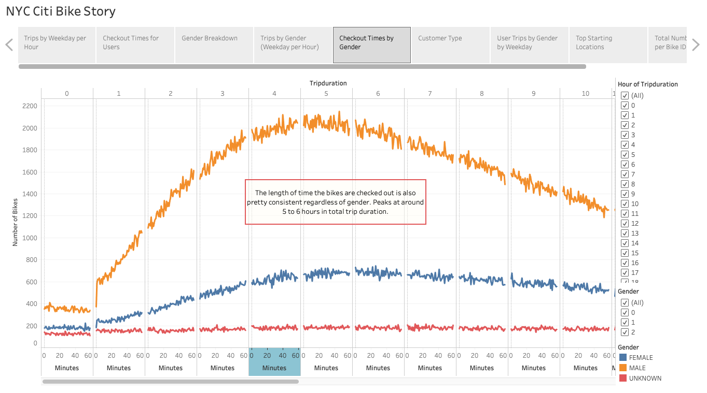
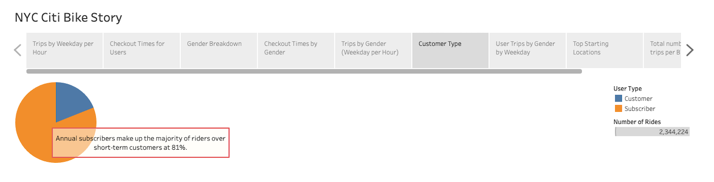
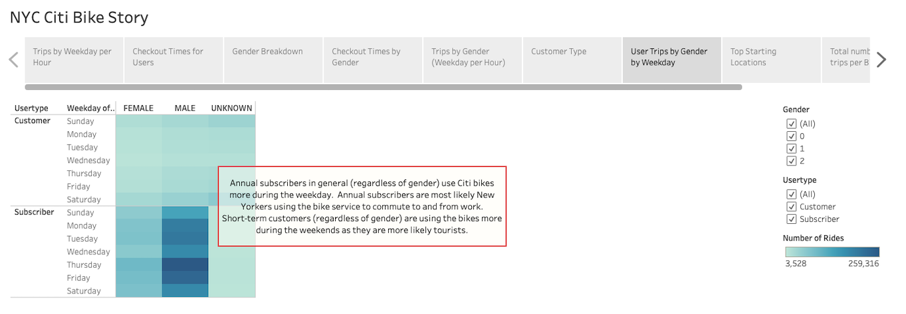
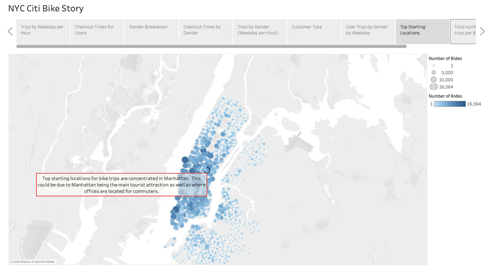
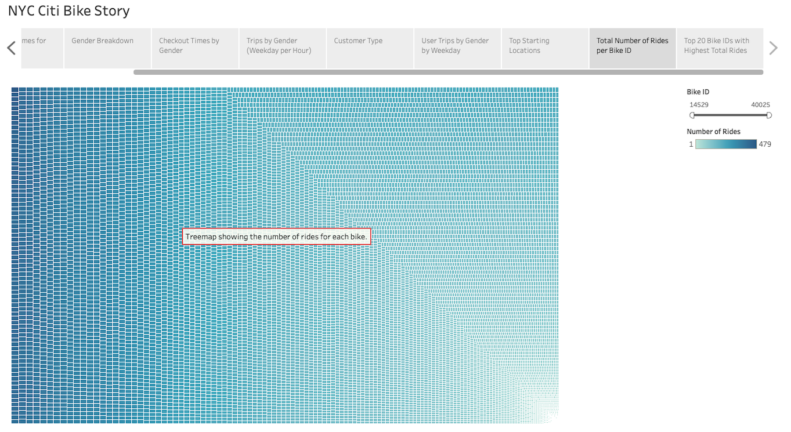
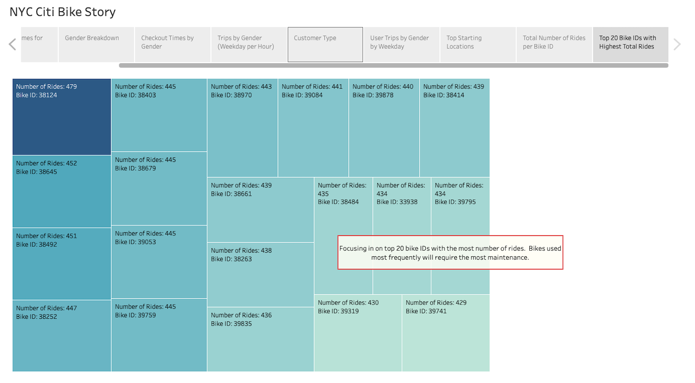

# **Bike-sharing**

## **1. Overview**
After our amazing trip to New York City, Kate and I decided to analyze the city's Citi Bike program to see if the bike sharing program is a viable business in our hometown of Des Moines, Iowa.  

For this project, we are utilizing *Tableau* to create a story to present our key outcomes and analysis to a potential angel investor.

## **2. Results**
Our *Tableau Story* for the bike-sharing analysis can be found here: [NYC Citi Bike Story](https://public.tableau.com/profile/inky.son#!/vizhome/Module_14_Challenge/NYCCitiBikeStory?publish=yes)

- Trips by Weekday per Hour

    
    - We started our *Tableau Story* with an overview of the bike trips by weekday per hour for all riders.  As you can see from this heatmap visualization, peak hours for rides are from 5pm to 7pm (and also between 8am to 9am).  These are typical rush hours for commuters so the narrative makes sense that these peaks would fall during the week days.
    - On weekends, bike trips are pretty consistent through out the day (from 10am to 6pm).  It can be assumed that more tourists are in town during the weekends and are therefore utilizing the bike-sharing program throughout the day.   

- Checkout Times for Users

    
    - Next we wanted to see the trip duration for each of the bikes for all users.  This visualization shows that the highest number of riders are renting the bikes for around 5 hours.  This could be due to more riders utilizing the Citi Bike program for leisure rides through the city than commuting to and from work.  

- Gender Breakdown

    
    - We wanted to take a look at the gender breakdown of riders.  This could be useful for marketing purposes for our Des Moines BikeShare program.
    - As this pie chart shows, 65% of the Citi Bike users are male.

- Trips by Gender (Weekday per Hour)

    
    - When we re-analyze the bike trips by weekday per hour but broken down by gender, you can see from this heat map that the results are consistent with the overall results.  Regardless of gender, it peaks during rush hours on weekdays and consistent throughout the day on weekends.

- Checkout Times by Gender 

    
    - Again, when we break down the trip duration for each of the bikes by gender, the arc of the line graph follows a similar path to the overall result.  The highest number of riders regardless of gender are renting the bikes for around 5 to 6 hours.

- Customer Type

    
    - There are 2 types of users of the Citi Bike program: annual subscribers and short-term customers.  It can be concluded that annual subscribers are local New Yorkers who frequently use the bike-share program for commuting purposes.  Short-term customers are more likely tourists using Citi Bike to tour around the city.  81% of the users are annual subscribers. 

- User Trips by Gender by Weekday

    
    - This visualization confirms our theory that subscribers are most likely locals using Citi Bikes for commuting purposes.  You can see that the peaks are during the weekdays for subscribers whereas the number of rides peak slightly during the weekends for short-term customers.
    - Also interesting to note is how subscribers skew greatly to males.  Could this be due to more men working in an office environment than women in New York City?  This would require further analysis. 

- Top Starting Locations

    
    - It is also important to analyze the start location of the bike trips.  This helps to ensure there are sufficient bikes in high trafficked locations so that we are not missing out on revenue opportunities.
    - This visualization shows that starting locations for bike trips are concentrated in Manhattan.  This could be due to Manhattan being the main tourist attraction area as well as where majority of the offices are located for commuters.

- Total Number of Rides per Bike ID

    
    - Finally, an important aspect of analyzing a new business venture is to review the possible expenses.  With a bike-share business, the biggest expense will most likely be bike maintenance.  It can be concluded that bikes that are used most often will be the ones needing the most upkeep.
    - The above treemap show the total number of rides by each bike.

- Top 20 Bike IDs with Highest Total Rides

    
    - As the treemap visualization can be a bit overwhelming, we've zeroed in on the top 20 bike ids with the most number of rides.  These top bikes will most likely incur the highest upkeep expense.

## **3. Summary**
In summary, we have created an effective *Tableau Story* to present to our potential angel investor the key outcomes from our analysis of the Citi Bike program in NYC.  How does this analysis translate to starting the Des Moines Bikeshare program?  From the results we can conclude that:

- During the weekdays, bike-sharing program usage will be concentrated with commuters.  We should ensure that we create ample bike-share docking stations near office buildings.
- Bike-share programs are popular with tourists.  We need to ensure that docking stations are near tourist attractions as well as work with Des Moines hotels to provide accessibility to the bike-share program onsite.
- From the data, men are the majority of bike-sharing riders.  We can grow the ridership pie by increasing female ridership.  This can be done by marketing specific to females with details such as outfitting each bike with a basket to hold purses.

**Additional Visualizations:**
- Create a visualization by age group utilizing the Birth Year data from the dataset.  This will allow us to analyze what age groups are using the bike-share program and assist in marketing specific to these groups.
- Another helpful visualization could be to create the start and end trip locations on the same map.  This will show the distance each trip takes as trip duration doesn't necessarily mean that the rider is riding the bike the whole time.  This could be usedful in upkeep cost analysis.  If the bike has a high number of rides but the distance is relatively short, the bike may not necessarily require the amount of maintenance as originally thought.  
